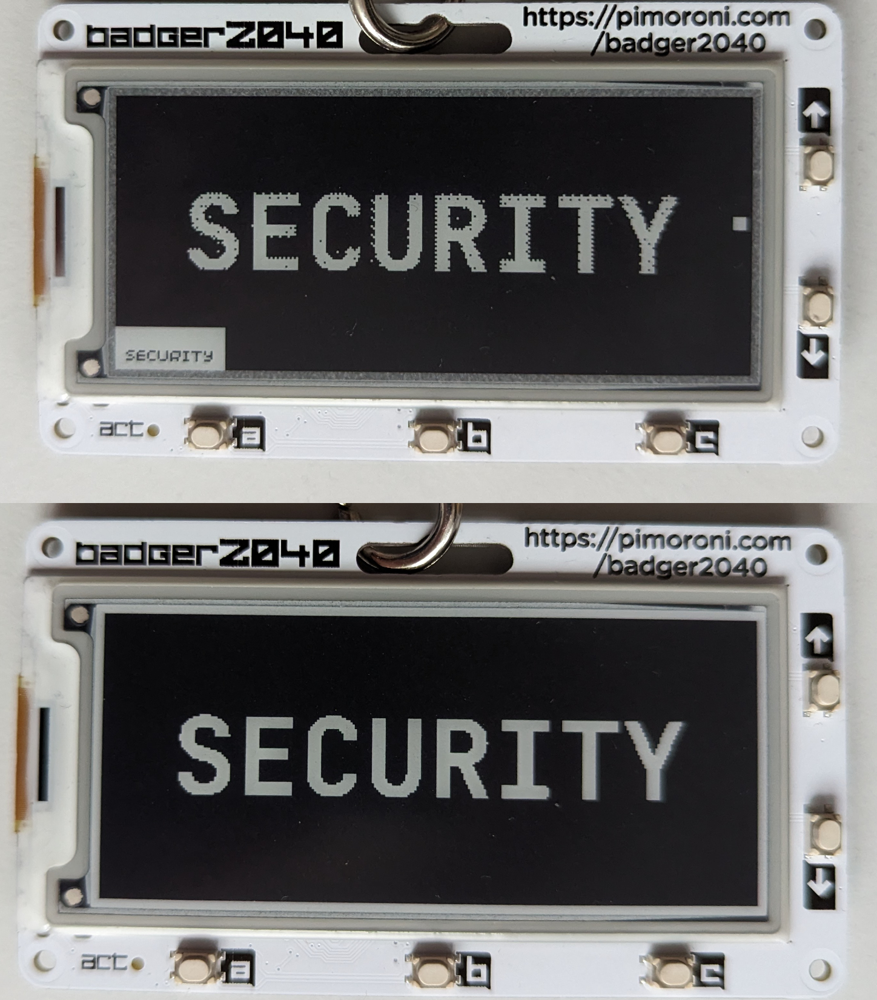
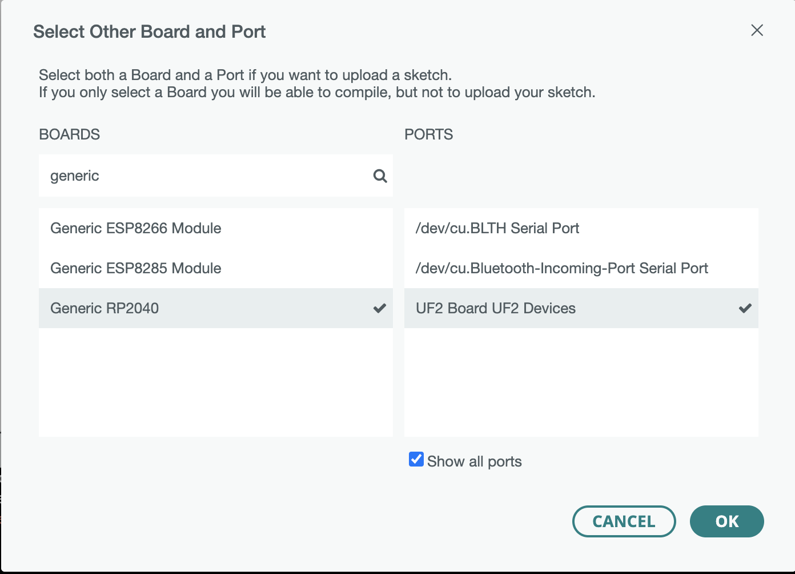
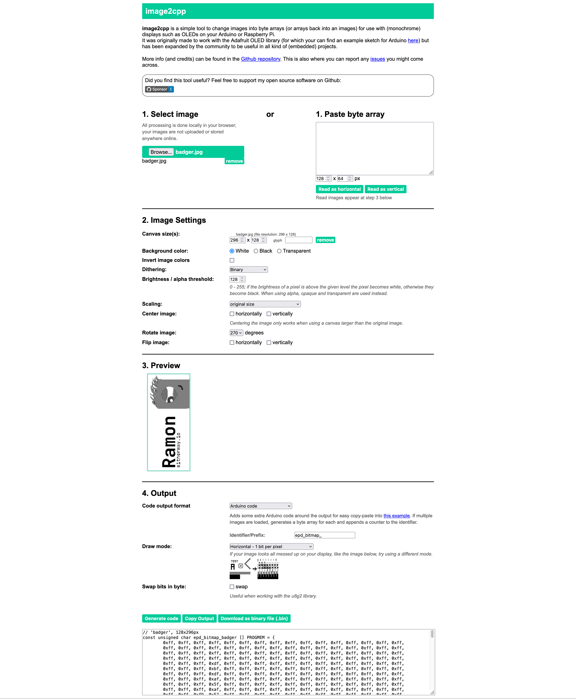

# Badger2040 - Custom Multiple Image Display

**What is this project?**

A small custom firmware, which allows to you to display custom images (presented by a bitmap) on your Badger2040.

**What is a Badger2040?**

Basically a Pi2040 with an ePaper Display strapped to it, that you can wear around your neck.

I've been to multiple conferences/meet-ups/networking events lately and on those events a name tag is helpful. And a programmable name tag is even better.

**Why not use the default BadgerOS?**

The default BadgerOS has a built-in method to display images, however it doesn't allow you to display a bitmap.

BadgerOS reads the images from Flash, decodes them automatically from JPEG and then displays them.

This can lead to some artifacts displayed on screen:

The top example is from BadgerOS. The bottom example is from this project.
You can clearly see the artefacts created by BadgerOS. 

## Setup of this Arduino Environment

Basically I followed [this setup](https://learn.adafruit.com/rp2040-arduino-with-the-earlephilhower-core/installing-the-earlephilhower-core) to setup my Arduino IDE.

I used the "Generic RP2040" Board to run my code on the Badger.

## Creating good images

The display has only the ability to display a black or white pixel.

However, you can still display different color shades. The process of "dithering" can be used to do this.

[This is a good online tool to do this.](https://www.gtab.nl/tools/dither) 

After you have converted the color parts of your original image, you can convert that image to a Bitmap, [e.g. with this online tool](https://javl.github.io/image2cpp/).

This bitmap can then be added to this project, e.g. in the `bitmaps.h` file.

## Display

The display of the Badger seems to have an uc8151d driver.

Important to know for this display is:

- 128x296 Pixel
- you should rotate your image by 270º degrees

Here are my settings for this display that results in one of my example bitmaps.

## Badger

You can find the [PIN-Out](https://github.com/pimoroni/pimoroni-pico/blob/main/libraries/badger2040/badger2040.hpp) here.
Generally the Pimoroni Source Code seems to be a good place to look for documentation. 